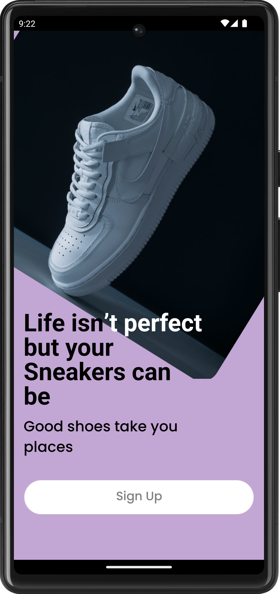
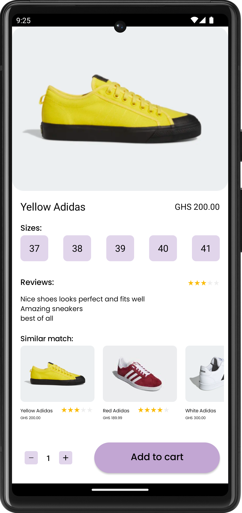
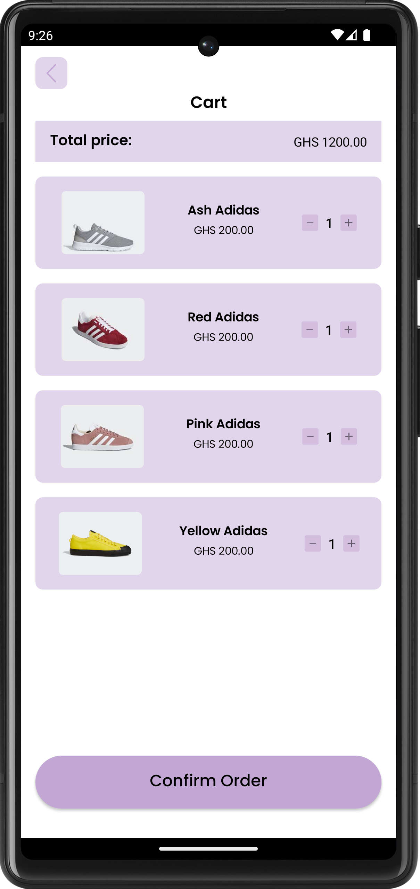

# Kicks-App
sneaker shopping app based on figma UI

# Installation
Install Android Studio on any compatible device

# Figma Reference
##### https://www.figma.com/file/ICEs5o5lqlbYsEgNu4Grg1/SneakerApp?node-id=12%3A304&t=C6ii2Yh2YqnaGUZt-0

# Screenshots
Screenshots of app

   

  

   

  

# App Visual

